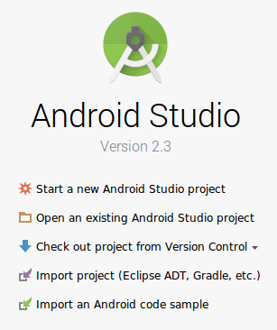
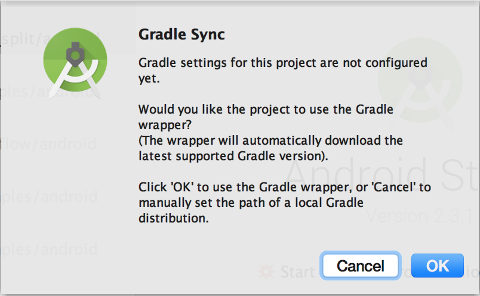
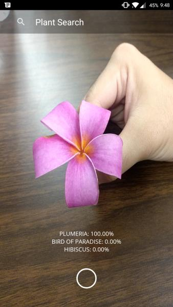
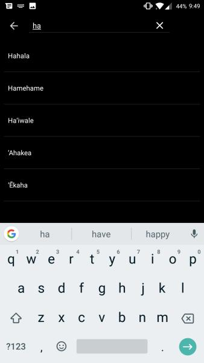
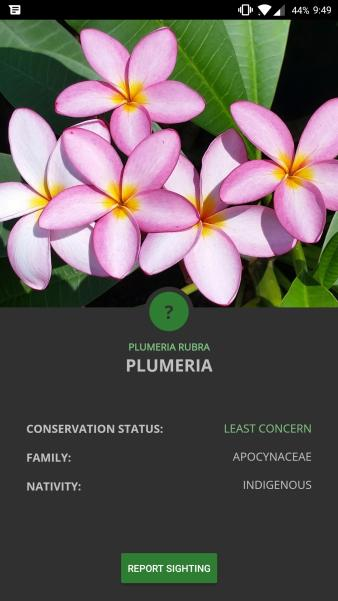
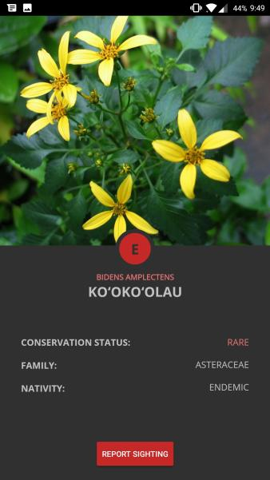

# AI.na


## Our Aina Vision
Our vision is to increase the percentage of threatened and endangered native species managed in Hawai'i by 2030 through a focus on sustainability goals demonstrated in the Aloha+ Challenge Dashboard. As students of the University of Hawai'i, we aim to ultimately provide sustainable solutions that are appropriately matched with technologies and platforms learned throughout our education career. We hope to give back to our Aina as much as it has given us.

### Our Challenge

### Our Solution

## Prerequisites

### Linux
A basic understanding of Linux is highly recommended as we will be using the terminal / commandline. To learn more about linux and its commands click [here](https://maker.pro/linux/tutorial/basic-linux-commands-for-beginners).

### Python
Python is an interpreted, object-oriented, high-level programming language with dynamic semantics. It is utilized in conjunction with TensorflowLite to train a model to identify the plants. Click [here](https://www.python.org/downloads/) to install the most recent version of Python.

### TensorFlowLite & Pillow
After installing Python, the next thing you would want to install is TensorFlowLite using PIP that comes with the Python installation. TensorFlow Lite is the official solution for running machine learning models on mobile and embedded devices. It enables on‑device machine learning inference with low latency and a small binary size on Android, iOS, and other operating 
systems. To learn more click [here](https://www.tensorflow.org/lite/).

Pillow is the friendly PIL fork by [Alex Clark and Contributors](https://github.com/python-pillow/Pillow/graphs/contributors). PIL is the Python Imaging Library by Fredrik Lundh and Contributors.

In the terminal / commandline: 
```
pip install tensorflow
pip install PILLOW
```

### Android Studio
After installing Tensorflow, the next thing you need to install is Android Studio. Android Studio is the official [Integrated Development Environment (IDE)](https://searchsoftwarequality.techtarget.com/definition/integrated-development-environment) for [Android app](https://en.wikipedia.org/wiki/Android_(operating_system)) development, based on [IntelliJ IDEA](https://www.jetbrains.com/idea/). Android Studio will be used as our main working environment. To learn more and download, click [here](https://developer.android.com/studio/).

### Clone the Repository
Clone the repository by doing git clone in the terminal / commandline:
```
git clone https://github.com/brendtmcfeeley/FlowerAI.git
```

## Set up the Application
Open AndroidStudio. After it loads select "Open an existing Android Studio project" from this popup:



In the file selector, choose FlowerAI/android/tflite from your working directory.

You will get a "Gradle Sync" popup, the first time you open the project, asking about using gradle wrapper. Click "OK".



To set up an emulator or a hardware device to run your app, click [here](https://developer.android.com/studio/run/) for more information.

### Interface

The app will open the camera as soon as it's loaded and will be running the model in real time! You can also choose to search plants that are in the database!

 

After selecting an item from the list you should see something like this!

 

You can then choose to press the Report Sighting button to report that plant to the agency or upload your own image of an unidentified plant to the database for the agencies to see what you've found!

# Much Mahalos

## HACC


We would like to thank [HACC](http://hacc.hawaii.gov/) for the opportunity to help contribute solutions to challenges focusing on social, economic, and environemntal factors that are faced today. This was an engaging experience with the community in trying to modernize state functions, services, and supporting the IT workforce development.

## Sponsors
We would also like to thank the sponsors, partners, and presenters for making such an event possible for not just us but for everyone else who had been involved with this competition!


## Our Ohana
This project would not have been possible without each every one of our amazing and talented teammates!

### Team Lead:

#### [Brendt Mcfeeley](https://www.linkedin.com/in/brendt-mcfeeley/)


### User Interface / User Experience Developers:

#### [Kenneth Lauritzen](https://linkedin.com/in/kenneth-lauritzen-49907216a/):


#### [Andrew Obatake](https://www.linkedin.com/in/andrew-obatake-8a5232106/):


### Machine Learning / Backend Developers:

#### [Sae Hyun Song](https://www.linkedin.com/in/sae-hyun-song/)

:

#### [Kian Kobayashi](https://www.linkedin.com/in/kiankobayashi/):


